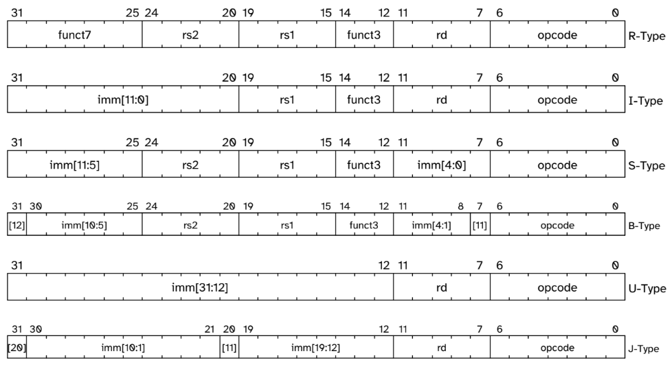
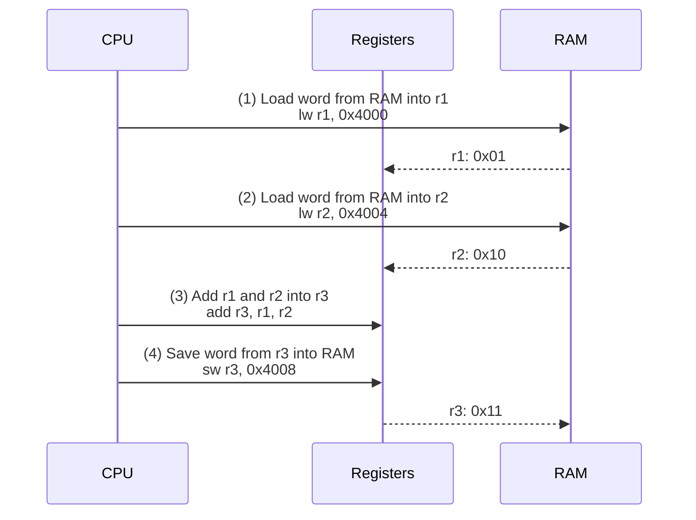
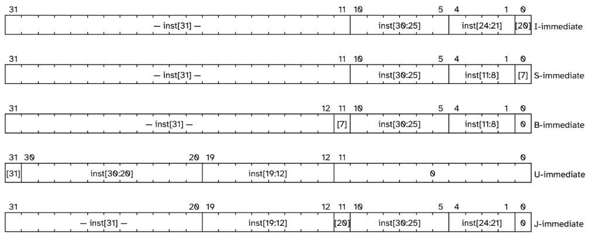

# risc-v

This repository contains [VHDL](https://en.wikipedia.org/wiki/VHDL) implementations of three CPU architectures using the [RV32I ISA](https://riscv-software-src.github.io/riscv-unified-db/manual/html/isa/isa_20240411/chapters/rv32.html): [`Unicycle`](/unicycle), [`Multicycle`](/multicycle) and [`Pipeline`](/pipeline).

This README will focus on basic RISC-V and RV32I concepts, while the READMEs on the implementation folders will dive deeper on each particular CPU architecture, implementation details and show how to run each one.

This work is part of the Computer Architecture and Organization (CIC0099) course for my Computer Engineering undergrad at Universidade de Brasília.

# On RISC-V

_RISC_ stands for _Reduced Instruction Set Computer_, which means that the set of CPU instructions is a lot smaller, when compared to _CISC_ (_Complex Instruction Set Computer_), which runs most modern _x86_ CPUs. The number of instructions for _RISC-V_ is on the order of $10^2$, and _x86_ is on the order of $10^3$. Even though modern _x86_ architectures present a _CISC_ API to compilers, they use RISC-like execution internally, by way of decoding large and complex instructions into smaller operations (_μops_) that are very similar to _RISC_.

## RISC-V ISA

_RISC-V's_ ISA is modular and is composed of _1-of-N_ possible bases ([RVWMO](https://danielmangum.com/risc-v-tips/2022-01-05-rvwmo/) + RV32I | RV32E | RV64I | RV64E | RV128I) plus [optional extensions](https://www.cnx-software.com/2019/08/27/risc-v-bases-and-extensions-explained/#risc-v-extensions) (M, A, F, D, G, Q, L, C, B, T, P, V, Zk, H, S, etc.).

32-bit _RISC-V_ instructions (RV32I and RV32E) follow this encoding pattern:

<p align="center">
    
</p>

_RISC-V's_ ISA follows the _load-store_ (also called _register-register_) architecture: only load and store instructions can access memory, while other operations must use data that is already in registers. You can't perform addition between two memory addresses, for example. Below is a diagram of the steps needed to add two words saved on RAM and then save the result on RAM:



### Instruction Cycle

The instruction cycle is composed of 4 steps:

1. **Fetch**: get the next instruction from the `text` segment of memory. The PC holds the address for the instruction, stored in the Instruction Memory.
2. **Decode**: the Control Unit interprets the instruction and sends control signals to the ALU, Multiplexers, Immediate Extender, Data Memory and Register File.
3. **Execute**: The actual execution of the instruction. Data is read from registers, ALU operations are performed, the Program Counter is updated and results are written to registers.
4. **Repeat**.

### Register Sets

RV32I has 32 registers with an additional 32 if a floating point extension is enabled. The first register, x0 (zero) is a zero register, which means that loads from it are always 0 and stores have no effect. This makes for a simpler instruction set because it eliminates the need for special instruction formats and reduces the total number of instruction variants required.

With _x0_ available as a constant zero source, many common operations can be expressed using the same basic instruction templates. For instance, copying a register becomes `add rd, rs1, x0`, loading an immediate value uses `addi rd, x0, immediate`, and register clearing is simply `add rd, x0, x0`. This uniform approach means the processor's decode logic doesn't need special cases for different operand patterns, and compilers can generate code using consistent instruction formats rather than maintaining separate opcodes for conceptually similar operations.

Below are the registers and their use cases:

| Register Range | ABI Names | Description | Saved by |
|----------------|-----------|-------------|----------|
| x0 | zero | Always zero | N/A |
| x1 | ra | Return address | Caller |
| x2 | sp | Stack pointer | Callee |
| x3 | gp | Global pointer | N/A |
| x4 | tp | Thread pointer | N/A |
| x5-x7 | t0-t2 | Temporaries | Caller |
| x8-x9 | s0/fp, s1 | Saved registers (s0 = frame pointer) | Callee |
| x10-x17 | a0-a7 | Function arguments/return values | Caller |
| x18-x27 | s2-s11 | Saved registers | Callee |
| x28-x31 | t3-t6 | Temporaries | Caller |

### Memory Access

As mentioned above, _RISC-V_ is a load-store architecture. Most load-store instructions include a 12-bit offset (also called _Immediate_) and two register identifiers. One is the base register, the other is a destination register (for loads) or a source register (for a store). Instructions are in LE. _RISC-V_ lacks address-modes that write back to the registers (it does not auto-increment, for example).

_RISC-V_ manages memory systems that are shared between CPUs or threads by ensuring a thread of execution always sees its memory operations in the programmed order. But between threads and I/O devices, _RISC-V_ is simplified: it doesn't guarantee the order of memory operations, except by specific instructions, such as `fence`.

_RISC-V_ uses the [_Harvard Architecture_](https://en.wikipedia.org/wiki/Harvard_architecture)—separate data and instruction memories—to allow same-cycle access to both data and instruction, while _x86_ and _ARM_ uses the [_Von Neumann Architecture_](https://en.wikipedia.org/wiki/Von_Neumann_architecture)—2 cycles to access instruction and information. _Harvard_ is better for pipelining due to dual memory access, more secure and deterministic, has higher implementation cost due to needing more hardware and does not scale very well. _Von Neumann_ is simpler, allows dynamic memory allocation and dynamic linking, but needs more cycles. It is also vulnerable to code injection attacks, which happens when data is executed as code, and also buffer overflow attacks ([_Smashing The Stack For Fun And Profit_](https://phrack.org/issues/49/14) is a great read on this).

### Immediates

An **Immediate** is a constant value encoded directly into the instruction, rather than being stored at a register or memory. Using immeadiates, we can have an instruction add 5 to R6, instead of saving 5 to R5 and then adding R5 and R6. This is useful because RV32I's 32-bit instruction has a big portion of it's space used by the opcode and register addresses, such that we can't load a 32-bit constant in a single instruction. For example, if we wan't to load `0x12345678` into _x1_, we have to:
```
lui  x1, 0x12345    # load 0x12345 into the upper 20 bits of x1
addi x1, x1, 0x678  # add 0x678 into the lower 12 bits of x1
```
This is unecessary for values that fit in 12 bits, however.

This is how immediates are extended into 32 bits for the different instruction types:

<p align="center">
    
</p>

### Subroutine Calls, Jumps and Branches

`jal` (jump and link) stores it's return address into a register, instead of pushing it into the stack. `jal` has a 20-bit signed offset, which is doubled and added to the PC to generate a relative address to a 32-bit instruction.

`jalr` (jump and link-register) is similar to `jal` but adds a 12-bit offset to a base register, instead of 20 bits to the PC.

_RISC-V_ has no [CCR](https://en.wikipedia.org/wiki/Condition_code_register) (Condition Code Register) or [Carry Bit](https://en.wikipedia.org/wiki/Carry_bit); as such predication is unsupported. Instead it has short branches that perform comparisons: equal (`beq`: branch if equal), not-equal (`bne`: branch if not equal), less-than (`blt`: branch if less than), greater-than (`bge`: branch if greater-or-equal), less-than unsigned (`bltu`: branch if less-than unsigned) and greater-or-equal (`bgeu`: branch if greater-or-equal unsigned).

### Arithmetic and Logic Sets

The Integer Instruction Set (_I_) has a minimal set of integer instructions: add, subtract, shift, bitwise logic and branch comparison implemented in an [ALU](https://en.wikipedia.org/wiki/Arithmetic_logic_unit).

The Integer Multiplication Set (_M_) has (un)signed multiplication and division.

_RISC-V_ does not throw exceptions caused by overflow, underflow, subnormal and divide by zero due to lack of CCR and Carry Bit; instead it produces reasonable defaults.

### Atomic Memory Operations

TODO

### Packed SIMD

TODO

### Vector Set

TODO

### RV32I Instructions

Instructions can be of 5 different types:

- **R** (Register): Instructions that operate on two source registers and write to a destination register. The format includes opcode, destination register (`rd`), function code (`funct3`), two source registers (`rs1`, `rs2`), and additional function bits (`funct7`). Examples include `add`, `sub`, `and`, `or`, `xor`, `sll`, `srl`, `sra`, `slt`, and `sltu`.

- **I** (Immediate): Instructions that use an immediate value (12-bit signed constant) along with one source register. The format includes opcode, destination register (`rd`), function code (`funct3`), source register (`rs1`), and a 12-bit immediate field. Examples include `addi`, `andi`, `ori`, `xori`, load instructions (`lb`, `lh`, `lw`, `lbu`, `lhu`), and `jalr`.

- **S** (Store): Instructions used for storing data to memory. The immediate field is split across two parts of the instruction to accommodate the store address calculation. The format includes opcode, function code (`funct3`), two source registers (`rs1` for base address, `rs2` for data), and a split 12-bit immediate. Examples include `sb`, `sh`, and `sw`.

- **B** (Branch): Conditional branch instructions that compare two registers and branch based on the result. The immediate field represents a signed offset and is split across multiple fields, with the least significant bit always being 0 (since instructions are aligned). Examples include `beq`, `bne`, `blt`, `bge`, `bltu`, and `bgeu`.

- **U** (Upper immediate): Instructions that work with 20-bit immediates in the upper portion of a 32-bit word. These are used for loading large constants or computing addresses. The format includes opcode, destination register (`rd`), and a 20-bit immediate field. Examples include `lui` (Load Upper Immediate) and `auipc` (Add Upper Immediate to PC).

- **J** (Jump): Jump instructions with a large immediate field for the target address. The immediate is 20 bits and represents a signed offset from the current PC, with the least significant bit being 0. The only RV32I J-type instruction is `jal` (Jump and Link).

These tables list (most?) _RV32I's_ instructions and pseudo-instructions:

| Pseudo-instruction | Actual Instruction | Purpose |
|-------------------|-------------------|---------|
| `nop` | `addi x0, x0, 0` | No operation |
| `mv x1, x2` | `addi x1, x2, 0` | Move/copy register |
| `li x1, imm` | `addi x1, x0, imm` | Load small immediate |
| `j label` | `jal x0, label` | Unconditional jump |
| `ret` | `jalr x0, x1, 0` | Return from function |
| `call label` | `jal x1, label` | Function call |
| `beqz` | `beq t0, x0, label` | Branch if equal to 0 |

| Instruction | Type | Description | Example | Notes |
|-------------|------|-------------|---------|-------|
| **Integer Computation** |
| `add` | R | Add registers | `add x1, x2, x3` | x1 = x2 + x3 |
| `sub` | R | Subtract registers | `sub x1, x2, x3` | x1 = x2 - x3 |
| `addi` | I | Add immediate | `addi x1, x2, 100` | x1 = x2 + 100 |
| `slt` | R | Set less than | `slt x1, x2, x3` | x1 = (x2 < x3) ? 1 : 0 |
| `slti` | I | Set less than immediate | `slti x1, x2, 50` | x1 = (x2 < 50) ? 1 : 0 |
| `sltu` | R | Set less than unsigned | `sltu x1, x2, x3` | x1 = (x2 < x3) ? 1 : 0 (unsigned) |
| `sltiu` | I | Set less than immediate unsigned | `sltiu x1, x2, 50` | x1 = (x2 < 50) ? 1 : 0 (unsigned) |
| **Multiplication and Division (_M_)** |
| `mul` | R | Multiply | `mul x1, x2, x3` | x1 = (x2 * x3)[31:0] |
| `mulh` | R | Multiply high signed | `mulh x1, x2, x3` | x1 = (x2 * x3)[63:32] (signed) |
| `mulhsu` | R | Multiply high signed-unsigned | `mulhsu x1, x2, x3` | x1 = (x2 * x3)[63:32] (x2 signed, x3 unsigned) |
| `mulhu` | R | Multiply high unsigned | `mulhu x1, x2, x3` | x1 = (x2 * x3)[63:32] (unsigned) |
| `div` | R | Divide signed | `div x1, x2, x3` | x1 = x2 / x3 (signed) |
| `divu` | R | Divide unsigned | `divu x1, x2, x3` | x1 = x2 / x3 (unsigned) |
| `rem` | R | Remainder signed | `rem x1, x2, x3` | x1 = x2 % x3 (signed) |
| `remu` | R | Remainder unsigned | `remu x1, x2, x3` | x1 = x2 % x3 (unsigned) |
| **Logical Operations** |
| `and` | R | Bitwise AND | `and x1, x2, x3` | x1 = x2 & x3 |
| `andi` | I | Bitwise AND immediate | `andi x1, x2, 0xFF` | x1 = x2 & 0xFF |
| `or` | R | Bitwise OR | `or x1, x2, x3` | x1 = x2 \| x3 |
| `ori` | I | Bitwise OR immediate | `ori x1, x2, 0x80` | x1 = x2 \| 0x80 |
| `xor` | R | Bitwise XOR | `xor x1, x2, x3` | x1 = x2 ^ x3 |
| `xori` | I | Bitwise XOR immediate | `xori x1, x2, -1` | x1 = x2 ^ 0xFFFFFFFF (invert) |
| **Shift Operations** |
| `sll` | R | Shift left logical | `sll x1, x2, x3` | x1 = x2 << (x3 & 0x1F) |
| `slli` | I | Shift left logical immediate | `slli x1, x2, 4` | x1 = x2 << 4 |
| `srl` | R | Shift right logical | `srl x1, x2, x3` | x1 = x2 >> (x3 & 0x1F) (zero fill) |
| `srli` | I | Shift right logical immediate | `srli x1, x2, 8` | x1 = x2 >> 8 (zero fill) |
| `sra` | R | Shift right arithmetic | `sra x1, x2, x3` | x1 = x2 >> (x3 & 0x1F) (sign extend) |
| `srai` | I | Shift right arithmetic immediate | `srai x1, x2, 2` | x1 = x2 >> 2 (sign extend) |
| **Memory Access** |
| `lb` | I | Load byte | `lb x1, 8(x2)` | x1 = sign_extend(mem[x2+8][7:0]) |
| `lh` | I | Load halfword | `lh x1, 4(x2)` | x1 = sign_extend(mem[x2+4][15:0]) |
| `lw` | I | Load word | `lw x1, 0(x2)` | x1 = mem[x2][31:0] |
| `lbu` | I | Load byte unsigned | `lbu x1, 12(x2)` | x1 = zero_extend(mem[x2+12][7:0]) |
| `lhu` | I | Load halfword unsigned | `lhu x1, 6(x2)` | x1 = zero_extend(mem[x2+6][15:0]) |
| `sb` | S | Store byte | `sb x1, 8(x2)` | mem[x2+8][7:0] = x1[7:0] |
| `sh` | S | Store halfword | `sh x1, 4(x2)` | mem[x2+4][15:0] = x1[15:0] |
| `sw` | S | Store word | `sw x1, 0(x2)` | mem[x2][31:0] = x1[31:0] |
| **Branches** |
| `beq` | B | Branch if equal | `beq x1, x2, label` | if (x1 == x2) goto label |
| `bne` | B | Branch if not equal | `bne x1, x2, label` | if (x1 != x2) goto label |
| `blt` | B | Branch if less than | `blt x1, x2, label` | if (x1 < x2) goto label (signed) |
| `bge` | B | Branch if greater/equal | `bge x1, x2, label` | if (x1 >= x2) goto label (signed) |
| `bltu` | B | Branch if less than unsigned | `bltu x1, x2, label` | if (x1 < x2) goto label (unsigned) |
| `bgeu` | B | Branch if greater/equal unsigned | `bgeu x1, x2, label` | if (x1 >= x2) goto label (unsigned) |
| **Jumps** |
| `jal` | J | Jump and link | `jal x1, function` | x1 = PC + 4; goto function |
| `jalr` | I | Jump and link register | `jalr x1, x2, 8` | x1 = PC + 4; goto x2 + 8 |
| **Upper Immediates** |
| `lui` | U | Load upper immediate | `lui x1, 0x12345` | x1 = 0x12345000 |
| `auipc` | U | Add upper immediate to PC | `auipc x1, 0x1000` | x1 = PC + 0x1000000 |
| **System** |
| `ecall` | I | Environment call | `ecall` | systemcall / trap to higher privilege |
| `ebreak` | I | Environment break | `ebreak` | Debugger breakpoint |
| **Fence** |
| `fence` | I | Memory fence | `fence rw, rw` | Memory ordering constraint |
| `fence.i` | I | Instruction fence | `fence.i` | Synchronize instruction/data memory |
| **CSR Instructions** |
| `csrrw` | I | Atomic read/write CSR | `csrrw x1, 0x300, x2` | x1 = CSR[0x300]; CSR[0x300] = x2 |
| `csrrs` | I | Atomic read and set CSR | `csrrs x1, 0x300, x2` | x1 = CSR[0x300]; CSR[0x300] \|= x2 |
| `csrrc` | I | Atomic read and clear CSR | `csrrc x1, 0x300, x2` | x1 = CSR[0x300]; CSR[0x300] &= ~x2 |
| `csrrwi` | I | CSR read/write immediate | `csrrwi x1, 0x300, 5` | x1 = CSR[0x300]; CSR[0x300] = 5 |
| `csrrsi` | I | CSR read and set immediate | `csrrsi x1, 0x300, 5` | x1 = CSR[0x300]; CSR[0x300] \|= 5 |
| `csrrci` | I | CSR read and clear immediate | `csrrci x1, 0x300, 5` | x1 = CSR[0x300]; CSR[0x300] &= ~5 |
| **Privileged System** |
| `uret` | I | Return from user trap | `uret` | Return from user-mode exception |
| `sret` | I | Return from supervisor trap | `sret` | Return from supervisor-mode exception |
| `mret` | I | Return from machine trap | `mret` | Return from machine-mode exception |
| `wfi` | I | Wait for interrupt | `wfi` | Hint to stall until interrupt |
| `sfence.vma` | I | Supervisor fence | `sfence.vma x1, x2` | Fence virtual memory system |

### System Calls

This table has the codes that must be used when making syscalls via `ecall`:

> These syscall codes only are good for [RARS](https://github.com/TheThirdOne/rars/), real OSes have other codes.

| Code | syscall | Arguments | Return | Description |
|------|---------|-----------|--------|-------------|
| 1 | print_int | a0 = integer | - | Print integer to stdout |
| 2 | print_float | f12 = float | - | Print float to stdout |
| 3 | print_double | f12 = double | - | Print double to stdout |
| 4 | print_string | a0 = string address | - | Print null-terminated string to stdout |
| 5 | read_int | - | a0 = integer | Read integer from stdin |
| 6 | read_float | - | f0 = float | Read float from stdin |
| 7 | read_double | - | f0 = double | Read double from stdin |
| 8 | read_string | a0 = buffer, a1 = length | - | Read string from stdin |
| 9 | sbrk | a0 = bytes | a0 = address | Allocate heap memory |
| 10 | exit | - | - | Terminate program |
| 11 | print_char | a0 = character | - | Print single character to stdout |
| 12 | read_char | - | a0 = character | Read single character from stdin |
| 13 | open | a0 = filename, a1 = flags, a2 = mode | a0 = file descriptor | Open file |
| 14 | read | a0 = fd, a1 = buffer, a2 = count | a0 = bytes read | Read from file |
| 15 | write | a0 = fd, a1 = buffer, a2 = count | a0 = bytes written | Write to file |
| 16 | close | a0 = file descriptor | a0 = status | Close file |
| 17 | exit2 | a0 = exit code | - | Terminate with exit code |
| 30 | time | - | a0 = time (ms) | Get system time |
| 32 | sleep | a0 = milliseconds | - | Sleep for specified time |
| 34 | print_hex | a0 = integer | - | Print integer as hexadecimal to stdout |
| 35 | print_binary | a0 = integer | - | Print integer as binary to stdout |
| 36 | print_unsigned | a0 = integer | - | Print integer as unsigned to stdout |
| 40 | set_seed | a0 = seed | - | Set random seed |
| 41 | random_int | - | a0 = random int | Generate random integer |
| 42 | random_int_range | a0 = min, a1 = max | a0 = random int | Random int in range |
| 50 | confirm_dialog | a0 = message | a0 = result | Show confirmation dialog |
| 51 | input_dialog_int | a0 = message | a0 = integer | Input dialog for integer |
| 52 | input_dialog_float | a0 = message | f0 = float | Input dialog for float |
| 53 | input_dialog_double | a0 = message | f0 = double | Input dialog for double |
| 54 | input_dialog_string | a0 = message, a1 = buffer, a2 = length | - | Input dialog for string |
| 55 | message_dialog | a0 = message, a1 = type | - | Show message dialog |
| 56 | message_dialog_int | a0 = message, a1 = int | - | Show message with integer |
| 57 | message_dialog_float | a0 = message, f12 = float | - | Show message with float |
| 58 | message_dialog_double | a0 = message, f12 = double | - | Show message with double |
| 59 | message_dialog_string | a0 = message, a1 = string | - | Show message with string |
