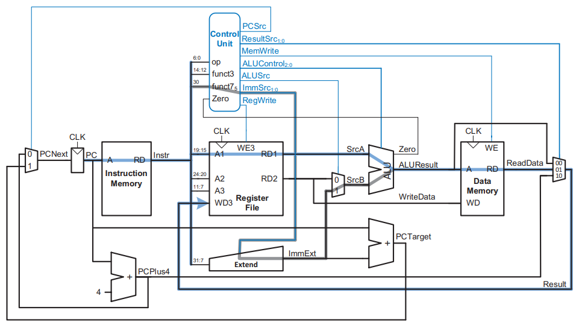

# RISC-V Unicycle Processor

This project implements the Unicycle (referred as Single Cycle) Processor from [_Digital Design and Computer Architecture: RISC-V Edition_](../static/digital-design-computer-architecture-riscv.pdf) from Chapter 7.3.

<p align="center">
  
</p>

## Usage

### Dependencies

This project uses on [`just`](https://github.com/casey/just) for command running, [`ghdl`](https://github.com/ghdl/ghdl) for VHDL compilation and [`gtkwave`](https://github.com/gtkwave/gtkwave) for visualization. To install them on Debian-based distros:

```shell
~$ apt install just ghdl gtkwave
```

### Running

To list available recipes:
```shell
~$ just
Available recipes:
    clean                      # Delete artifacts from work directory
    test component="component" # Test individual components: cpu, adder, alu, control, dmem, imem, immext, mux, pc, regfile
    test-all                   # Test all components
    wave component="component" # Test and view waveforms for components: cpu, adder, alu, control, dmem, imem, immext, mux, pc, regfile (press CTRL+0 to adjust the zoom)
```

`just test cpu` will run the CPU against the the assembly code below, which loads the value on the address pointed to by the Global Pointer (`gp`) onto `x5` and then doubles it in a loop:

```asm
.data
.word 1

.text
    #li gp,0x10010000
    lw t0,0(gp)
LOOP:  add t0,t0,t0
    j LOOP
```

```shell
src/cpu.vhd:451:9:@25ns:(report note): [1] PC: 0x00000000
src/cpu.vhd:452:9:@25ns:(report note): [1] Instr: 0x0001A283 (lw x5, 0(x3))
src/cpu.vhd:453:9:@25ns:(report note):
src/cpu.vhd:459:13:@35ns:(report note): [2] PC: 0x00000004
src/cpu.vhd:460:13:@35ns:(report note): [2] Instr: 0x005282B3 (add x5, x5, x5)
src/cpu.vhd:462:13:@35ns:(report note): [2] CU: RegWrite='1' MemWrite='0' ALUSrc='0' PCSrc='0'
src/cpu.vhd:465:17:@35ns:(report note): [2] Write to x5: 0x00000002
src/cpu.vhd:468:13:@35ns:(report note): [2] ALU: 0x00000001 + 0x00000001 = 0x00000002 (Zero='0')
src/cpu.vhd:469:13:@35ns:(report note):
src/cpu.vhd:459:13:@45ns:(report note): [3] PC: 0x00000008
src/cpu.vhd:460:13:@45ns:(report note): [3] Instr: 0xFFDFF06F (jal x0, -4)
src/cpu.vhd:462:13:@45ns:(report note): [3] CU: RegWrite='1' MemWrite='0' ALUSrc='0' PCSrc='1'
src/cpu.vhd:468:13:@45ns:(report note): [3] ALU: 0x00000000 + 0x00000000 = 0x00000000 (Zero='1')
src/cpu.vhd:469:13:@45ns:(report note):
src/cpu.vhd:459:13:@55ns:(report note): [4] PC: 0x00000004
src/cpu.vhd:460:13:@55ns:(report note): [4] Instr: 0x005282B3 (add x5, x5, x5)
src/cpu.vhd:462:13:@55ns:(report note): [4] CU: RegWrite='1' MemWrite='0' ALUSrc='0' PCSrc='0'
src/cpu.vhd:465:17:@55ns:(report note): [4] Write to x5: 0x00000004
src/cpu.vhd:468:13:@55ns:(report note): [4] ALU: 0x00000002 + 0x00000002 = 0x00000004 (Zero='0')
src/cpu.vhd:469:13:@55ns:(report note):
src/cpu.vhd:459:13:@65ns:(report note): [5] PC: 0x00000008
src/cpu.vhd:460:13:@65ns:(report note): [5] Instr: 0xFFDFF06F (jal x0, -4)
src/cpu.vhd:462:13:@65ns:(report note): [5] CU: RegWrite='1' MemWrite='0' ALUSrc='0' PCSrc='1'
src/cpu.vhd:468:13:@65ns:(report note): [5] ALU: 0x00000000 + 0x00000000 = 0x00000000 (Zero='1')
src/cpu.vhd:469:13:@65ns:(report note):
src/cpu.vhd:459:13:@75ns:(report note): [6] PC: 0x00000004
src/cpu.vhd:460:13:@75ns:(report note): [6] Instr: 0x005282B3 (add x5, x5, x5)
src/cpu.vhd:462:13:@75ns:(report note): [6] CU: RegWrite='1' MemWrite='0' ALUSrc='0' PCSrc='0'
src/cpu.vhd:465:17:@75ns:(report note): [6] Write to x5: 0x00000008
src/cpu.vhd:468:13:@75ns:(report note): [6] ALU: 0x00000004 + 0x00000004 = 0x00000008 (Zero='0')
```

If you want to run something else, create MIF dumps (hexadecimal, no headers) for the `.data` and `.text` segments using [`RARS`](https://github.com/TheThirdOne/rars/) (first assemble the file, then File > Dump Memory with `Hexadecimal Text` as the Dump Format. Do this for both segments), then place them under `static/mif/data.mif` and `static/mif/text.mif`.

To see the signals for a component, run `just wave {component}` and press `CTRL+0` to resize the zoom.

## Architectural State and Instruction Set

A computer architecture is defined by its Architectural State (**AS**) and Instruction Set (**IS**). For the RISC-V processor, the **AS** consists of the Program Counter (**PC**) and the 32 32-bit Registers (Register File / Register Bank). Based on the current **AS**, the processor executes some instruction with some data to produce another **AS**.

The [`Program Counter`](#program-counter-register), [`Register File`](#register-file) and [`Data Memory`](#data-memory) are read _combinationally_: if the address changes, the new data appears after some propagation delay, but they are only written to on the rising edge of CLK. In this way, a processor can be viwed as a [Finite State Machine](https://en.wikipedia.org/wiki/Finite-state_machine).

The Unicycle CPU executes a single instruction per cycle, so has no need for _non-architectural_ state, but the cycle period floor lower-bounded by the slowest possible instruction. It also needs to have separate instruction and data memories.

## Design Process

The microarchitecture is divided in two: the _datapath_ and the _control unit_.

The datapath (DP) operates on words (32 bits, in this case) using memory, registers, ALUs and multiplexers. The Control Unit (CU) receives the current instruction from the datapath and tells it how to execute them by producing multiplexer select, register enable and memory write signals to control the flow of the datapath.

We start with hardware that contains state and then add blocks of combinational logic between them to compute the next state. We use 4 state elements: a Program Counter (PC), a Register File (RF), Instruction Memory and Data Memory.

## Components

### Adder

Simple generic width adder without overflow and underflow detection.

```vhdl
ENTITY adder IS
    GENERIC (
        WIDTH : INTEGER := 32
    );
    PORT (
        a : IN STD_LOGIC_VECTOR(WIDTH - 1 DOWNTO 0);
        b : IN STD_LOGIC_VECTOR(WIDTH - 1 DOWNTO 0);
        result : OUT STD_LOGIC_VECTOR(WIDTH - 1 DOWNTO 0)
    );
END ENTITY adder;
```

### Arithmetic Logic Unit (ALU)

The ALU is responsible for executing arithmetic operations over two inputs and a control signal that determines which operation it must perform. Outputs the result and a zero flag useful for branching operations (beq, bne, blt, bge).

```vhdl
ENTITY alu IS
    PORT (
        src_a      : IN STD_LOGIC_VECTOR(31 DOWNTO 0);   -- First Operand
        src_b      : IN STD_LOGIC_VECTOR(31 DOWNTO 0);   -- Second Operand
        alu_control: IN STD_LOGIC_VECTOR(2 DOWNTO 0);    -- Operator
        alu_result : OUT STD_LOGIC_VECTOR(31 DOWNTO 0);  -- Operation Result
        zero       : OUT STD_LOGIC                       -- Zero flag, used for branching
    );
END ENTITY alu;
```

### Control Unit

The Control Unit is responsible for computing control signals for most components of the CPU, such as the ALU, Data Memory, Instruction Memory, Register File, Immediate Extender and a few multiplexers.

```vhdl
ENTITY control_unit IS
    PORT (
        opcode      : IN STD_LOGIC_VECTOR(6 DOWNTO 0);  -- Specifies the instruction to be executed
        funct3      : IN STD_LOGIC_VECTOR(2 DOWNTO 0);  -- Further specifies the instruction to be executed
        funct7      : IN STD_LOGIC_VECTOR(6 DOWNTO 0);  -- Even further specifies the instruction to be executed
        zero        : IN STD_LOGIC;                     -- Whether the ALU operation resulted in zero
        pc_src      : OUT STD_LOGIC;                    -- Program Counter Multiplexer Source Selector
        result_src  : OUT STD_LOGIC_VECTOR(1 DOWNTO 0); -- Selector for the multiplexer that sources the next Program Couter value (PC+4 for sequential execution OR PCTarget for branches/jumps/calls)
        mem_write   : OUT STD_LOGIC;                    -- Enabler for writing to the Data Memory
        alu_control : OUT STD_LOGIC_VECTOR(2 DOWNTO 0); -- Selects the operator the ALU must use
        alu_src     : OUT STD_LOGIC;                    -- Selector for the ALUSrcB multiplexer
        imm_src     : OUT STD_LOGIC_VECTOR(1 DOWNTO 0); -- Selector for the Immediate Extension operation conditional on instruction type (I OR S OR B OR (J & U))
        reg_write   : OUT STD_LOGIC                     -- Enabler for writing to the register file
    );
END ENTITY control_unit;
```

### Data Memory

The Data Memory is the RAM of the CPU, responsible for storing the `.data` segment, the heap and the stack. This implementation supports generic address and data widths.

```vhdl
ENTITY data_memory IS
    GENERIC (
        ADDR_WIDTH : INTEGER := 10;
        DATA_WIDTH : INTEGER := 32;
        MIF_FILE : STRING := "static/mif/data.mif"
    );
    PORT (
        clk : IN STD_LOGIC;
        addr : IN STD_LOGIC_VECTOR(31 DOWNTO 0);    -- Address data must be written to or read from
        wr_data : IN STD_LOGIC_VECTOR(31 DOWNTO 0); -- Data to be written to address `addr`
        wr_en : IN STD_LOGIC;                       -- Enabler for writing to the Data Memory
        rd_data : OUT STD_LOGIC_VECTOR(31 DOWNTO 0) -- Data currently written at `addr`
    );
END ENTITY data_memory;
```

### Instruction Memory

The Instruction Memory is the ROM of the CPU, responsible for storing the `.text` segment: the program itself. This is the address space the Program Counter points to, the CPU will execute whatever instruction the PC is pointing to.

```vhdl
ENTITY instruction_memory IS
    GENERIC (
        ADDR_WIDTH : INTEGER := 10;
        DATA_WIDTH : INTEGER := 32;
        MIF_FILE : STRING := "static/mif/text.mif"
    );
    PORT (
        addr : IN STD_LOGIC_VECTOR(31 DOWNTO 0); -- Address to be read from
        rd : OUT STD_LOGIC_VECTOR(31 DOWNTO 0)   -- Data written to `addr`
    );
END ENTITY instruction_memory;
```

### Immediate Extender

Extends the immediate to the full 32 bits using sign extension (left pad with the sign bit until 32 bits). The values of `ImmSrc` we're chosen arbitrarly and are generated by the [Control Unit](#control-unit).

```vhdl
ENTITY immediate_extender IS
    PORT (
        instr : IN STD_LOGIC_VECTOR(31 DOWNTO 0);   -- The 32-bit instruction
        imm_src : IN STD_LOGIC_VECTOR(1 DOWNTO 0);  -- The type of Immediate that must be assembled from `instr`
        imm_ext : OUT STD_LOGIC_VECTOR(31 DOWNTO 0) -- The Extended Immediate
    );
END ENTITY immediate_extender;
```

### Multiplexers

Basic 2-input and 4-input multiplexers, used for signal selection.

```vhdl
ENTITY mux2 IS
    GENERIC (
        WIDTH : INTEGER := 32
    );
    PORT (
        d0 : IN STD_LOGIC_VECTOR(WIDTH - 1 DOWNTO 0);
        d1 : IN STD_LOGIC_VECTOR(WIDTH - 1 DOWNTO 0);
        sel : IN STD_LOGIC;
        y : OUT STD_LOGIC_VECTOR(WIDTH - 1 DOWNTO 0)
    );
END ENTITY mux2;

ENTITY mux4 IS
    GENERIC (
        WIDTH : INTEGER := 32
    );
    PORT (
        d0 : IN STD_LOGIC_VECTOR(WIDTH - 1 DOWNTO 0);
        d1 : IN STD_LOGIC_VECTOR(WIDTH - 1 DOWNTO 0);
        d2 : IN STD_LOGIC_VECTOR(WIDTH - 1 DOWNTO 0);
        d3 : IN STD_LOGIC_VECTOR(WIDTH - 1 DOWNTO 0);
        sel : IN STD_LOGIC_VECTOR(1 DOWNTO 0);
        y : OUT STD_LOGIC_VECTOR(WIDTH - 1 DOWNTO 0)
    );
END ENTITY mux4;
```

### Program Counter Register

The Program Counter stores the address of the instruction to be executed. On the rising edge of the clock signal, PC = PCNext. Fundamentally, it's just 32 D flip-flops connected to CLK.

```vhdl
ENTITY pc_register IS
    PORT (
        clk : IN STD_LOGIC;
        reset : IN STD_LOGIC;
        pc_next : IN STD_LOGIC_VECTOR(31 DOWNTO 0);
        pc : OUT STD_LOGIC_VECTOR(31 DOWNTO 0)
    );
END ENTITY pc_register;
```

### Register File

32 32-bit registers. Most are used for fast and temporary data storage. Some have fixed uses and others are used at the discretion of the programmer; `x0` is always zero, `x1` is the return address, `x2` is the Stack Pointer, `x3` is the Global Pointer and `x4` is the Thread Pointer, for example.

Loading and storing to a register is much faster than loading and storing to Data Memory (same-cycle acess).

```vhdl
ENTITY register_file IS
    PORT (
        clk : IN STD_LOGIC;
        reset: IN STD_LOGIC;
        a1  : IN STD_LOGIC_VECTOR(4 DOWNTO 0);    -- Specifies from what register data must be read from into `RD1`
        a2  : IN STD_LOGIC_VECTOR(4 DOWNTO 0);    -- Specifies from what register data must be read from into `RD2`
        rd1 : OUT STD_LOGIC_VECTOR(31 DOWNTO 0);  -- The data stored at register `A1`
        rd2 : OUT STD_LOGIC_VECTOR(31 DOWNTO 0)   -- The data stored at regsiter `A2`
        we3 : IN STD_LOGIC;                       -- Enabler for writing to register `A3`
        a3  : IN STD_LOGIC_VECTOR(4 DOWNTO 0);    -- Specifies from what register data must be written to from `WD3`
        wd3 : IN STD_LOGIC_VECTOR(31 DOWNTO 0);   -- Data to be written to register `A3`
    );
END ENTITY register_file;
```
