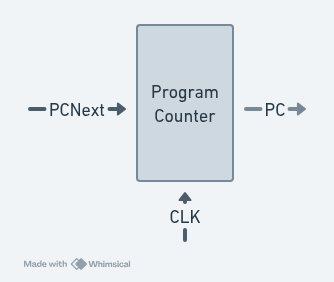
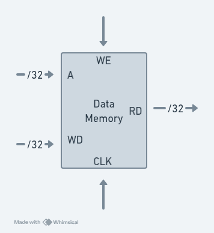
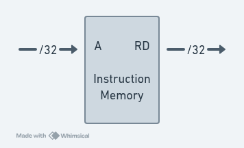
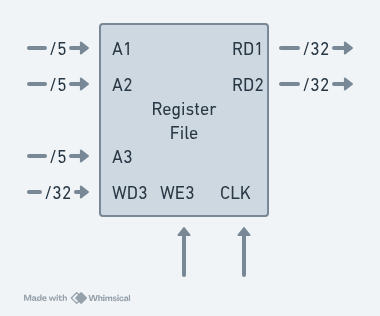

# RISC-V Unicycle Processor

This project implements the Unicycle (referred as Single Cycle) Processor from _Digital Design and Computer Architecture: RISC-V Edition_ with some modifications to support the `jalr` instruction.

<p align="center">
  
</p>

## Usage

### Dependencies

This project depends on [`just`](https://github.com/casey/just) for command running, [`ghdl`](https://github.com/ghdl/ghdl) for VHDL compilation and [`gtkwave`](https://github.com/gtkwave/gtkwave) for visualization. To install them on Debian-based distros:

```shell
apt install just ghdl gtkwave
```

### Running

## Architectural State and Instruction Set

A computer architecture is defined by its Architectural State (**AS**) and Instruction Set (**IS**). For the RISC-V processor, the **AS** consists of the Program Counter (**PC**) and the 32 32-bit Registers (Register File / Register Bank). Based on the current **AS**, the processor executes some instruction with some data to produce another **AS**.

## Design Process

The microarchitecture is divided in two: the _datapath_ and the _control unit_.

The datapath (DP) operates on words (32 bits, in this case) using memory, registers, ALUs and multiplexers. The Control Unit (CU) receives the current instruction from the datapath and tells it how to execute them by producing multiplexer select, register enable and memory write signals to control the flow of the datapath.

We start with hardware that contains state and then add blocks of combinational logic between them to compute the next state. We use 4 state elements: a Program Counter (PC), a Register File (RF), Instruction Memory and Data Memory.

**Program Counter**: takes in the next instruction's address and outputs the current instruction address on the rising edge of CLK.

<p align="center">
  
</p>

**Data Memory**: If WE is enabled, it will write WD onto address A; if WE is disabled, it will read A onto RD.

<p align="center">
  
</p>

**Instruction Memory**: A ROM that takes in a 32-bit address as input (A) and outputs the 32-bit instruction at that address (RD).

<p align="center">
  
</p>

**Register File**: holds the 32 registers. A1 and A2 take in 5-bit address inputs that specify one of the 2^5 registers. The register file will put the corresponding register values onto RD1 and RD2. A3 and WD3 specify a register and data that must be written to it at the rising edge of CLK, if WE3 is enabled.

<p align="center">
  
</p>


The Instruction Counter, Register File and Data Memory are read _combinationally_: if the address changes, the new data appears after some propagation delay, but they are only written to on the rising edge of CLK. In this way, a processor can be viwed as a [Finite State Machine](https://en.wikipedia.org/wiki/Finite-state_machine).

The Unicycle architecture executes a single instruction per cycle, so has no need for _non-architectural_ state, but the cycle time is limited by the slowest instruction, and also needs to have separate instruction and data memory.

